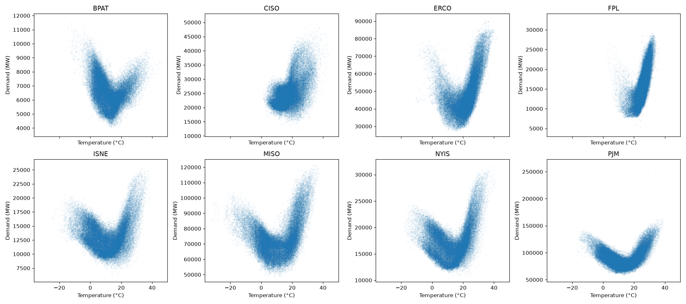

# Horizon - Operational Electricity Demand Forecasting💡
**What makes electricity demand so hard to predict? Sometimes it's the sun☀️.**

This project predicts how much electricity a region will use **tomorrow, hour by hour,** and the single hardest region to predict turned out to be covered in solar panels. It measures itself against the one benchmark that actually matters: the grid operators' own published forecasts. 

# In California, it beats them.
**Status:** Live and growing. The data pipeline, benchmarking, features, backtesting, and models are complete. Uncertainty quantification and deployment are next.

# The result, up front🎯

| Region | Mean | Ridge | LightGBM | Operator Baseline |
|---|---:|---:|---:|---:|
| CISO | 11.46% | 4.79% | **3.54%** | 5.04% | **beat them**
| ERCO | 13.92% | 5.72% | **4.14%** | 2.43% | close
| MISO | 11.13% | 3.98% | **3.27%** | 2.82% | close 
| FPL | 20.28% | 5.83% | **4.59%** | 3.67% | close

Error = MAPE(mean average % error). Lower is better. Averaged over 8 time-ordered backtests.

Three regions aren't beaten yet and that's the honest state of the work. But California isn't luck. **I predicted it would be the winnable one before training a single model.**

# Motivation behind this work

Every grid operator in the world forecasts tomorrow's electricity demand and if they get it wrong, the consequences are real: too low risks a blackout, too high wastes money on idle reserve power. Usefully, they publish those forecasts next to what actually happened. That makes this real world prediction problems which comes with a real professional benchmark built in it.

# To-do

Build a forecasting system that beats those published forecasts - honestly, with no peeking at the feature and understand why it wins or loses in each region.

# Approach
Eight years of hourly data, eight US grid regions, build end to end:
1. **👩‍💻Scraped two live APIs** grid demand and weather data with pagination and rate-limiting using Python and REST into .json files.
2. **📊Shaped the raw JSON into tables** parsing, typing, timezone handling using pandas.
3. **🗄️Loaded it into queryable dataset** with enforced constraints (SQL, DuckDB)
4. **🔍Audited the data** and found four hidden defects
5. **🌡️Engineered features from physics** degree days, temperature curves, leakage-safe lags
6. **⏳Tested it the way reality works** a backtested built from scratch
7. **📈Climbed a model ladder** dumb baseline -> linear -> gradient-boosted trees (scikit-learn, LightGBM)

**Result.** Beat the California operators' own day-ahead forecast (3.54% vs 5.04%)-landing exactly where I predicted, for a reason rooted in physics.

## 🔬 Electricity is physics you can see

Plot a region's power use against outdoor temperature and a shape appears:

Every region draws a **U** (or half of one):
1. **Cold ->** heating switches on -> demand climbs
2. **Mild (~18°C) ->** nothing runs -> demand bottoms out
3. **Hot ->** air conditioning roars -> demand climbs again

We can literally read a city's climate off this chart. Miami has almost no left arm (Florida doesn't heat). Boston freezes, so its left arm is steep.

**California broke the pattern:** a flat, smeared top instead of a clean U. The reason: California reports net demand - total use **minus** the power its millions of rooftop solar panels quietly generate. On a sunny afternoon, solar cancels the AC load, so demand there depend on **cloud cover across the whole state**, genuinely hard to predict a day ahead.

That's why the oeprator's forecast is weakest there (5% error vs ~2-3% elsewhere), and why a model with good weather features has the most room to win. **The predicition was made before modelling. It held.**

## Verifications

Before modelling anything, I audited the raw data and it was quietly broken in four different ways:

| What I found | The tell |
|---|---:|---:|---:|---:|
| A demand reading of **2,147,483,647 MW** |The largest number a 32-bit integer can hold and a computer's "no data" placeholder leaking in a real data |
|**Six-hours blocks of zeros**||A reporting feed silently dropping out|
|**Negative electricity demand**| A daily-rollover bug, always at midnight|
|**Duplicate timestamps**| Two moments colliding at a daylight-saving boundary|

